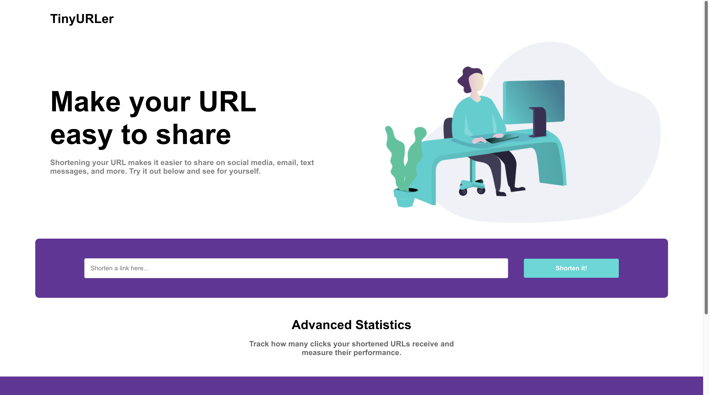

# URL Shortener Project

## Overview

This project is a simple URL shortener application built with a MERN stack (MongoDB, Express.js, React.js, Node.js). It allows users to shorten URLs and view the click counts for each shortened URL. The user interface displays the shortened URL and the history of past links with click counts.

## Features

- **URL Shortening**: Users can shorten long URLs.
- **Click Analytics**: Users can view the number of clicks on their shortened URLs.

## Screenshots


*URL Shortener Interface*

## Getting Started

### Prerequisites

Make sure you have the following installed:

- Node.js (v16.x.x recommended)
- MongoDB

### Installation

1. **Clone the repository**

    ```bash
    git clone https://github.com/your-username/url-shortener.git
    cd url-shortener
    ```

2. **Install Backend Dependencies**

    Navigate to the `backend` directory and install dependencies:

    ```bash
    cd backend
    npm install
    ```

3. **Install Frontend Dependencies**

    Navigate to the `frontend` directory and install dependencies:

    ```bash
    cd ../frontend
    npm install
    ```

### Configuration

1. **MongoDB Setup**

    Ensure MongoDB is running on your machine. You can change the MongoDB connection string in the `backend/config/db.js` file if necessary.

2. **Environment Variables**

    Create a `.env` file in the `backend` directory and add the following:

    ```plaintext
    MONGO_URI=mongodb://localhost:27017/url-shortner-software
    ```

### Running the Application

1. **Start the Backend Server**

    Navigate to the `backend` directory and start the server:

    ```bash
    cd backend
    npm start
    ```

    The backend server will start on port 8001.

2. **Start the Frontend Server**

    Open a new terminal, navigate to the `frontend` directory, and start the React application:

    ```bash
    cd frontend
    npm start
    ```

    The frontend server will start on port 3000.

### Usage

1. **Open the Application**

    - Open your browser and navigate to `http://localhost:3000`.

2. **Shorten URLs**

    - Enter a long URL in the input box and click the "Submit" button.
    - The shortened URL will be displayed below the input box.

3. **View Click Counts**

    - The click counts for each shortened URL will be displayed in the analytics section below the input box.

## Project Structure

url-shortener/

├── assets/
├── backend/
│ ├── controllers/
│ ├── models/
│ ├── routes/
│ ├── connect.js
│ ├── index.js
│ ├── package.json
│ └── README.md
├── frontend/
│ ├── public/
│ ├── src/
│ ├── package.json
│ └── README.md
└── README.md

## Contributing

Feel free to open issues or submit pull requests with improvements. For major changes, please open an issue first to discuss what you would like to change.
